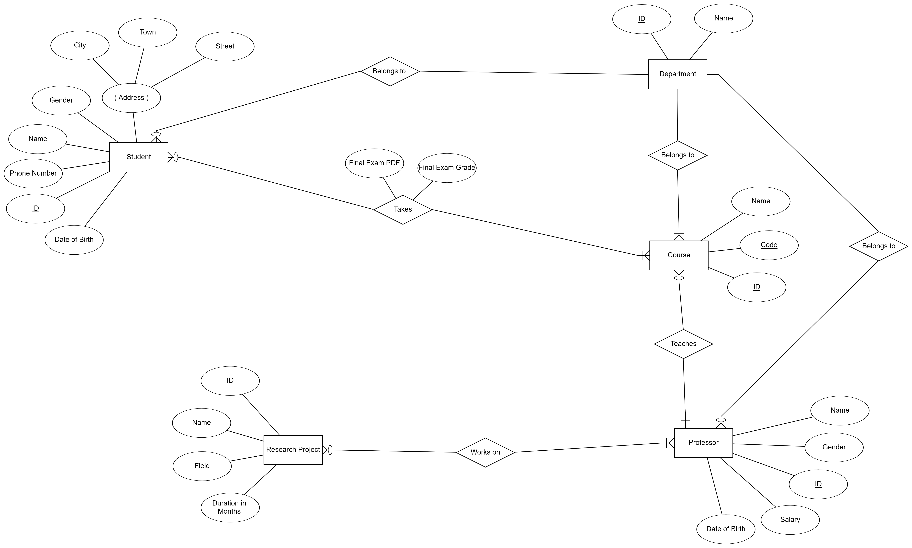
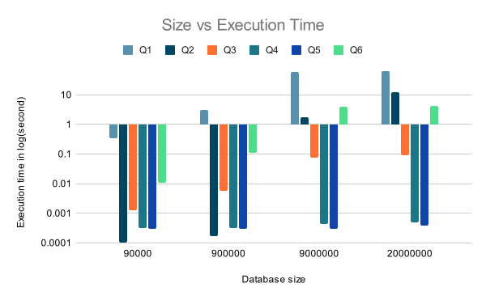
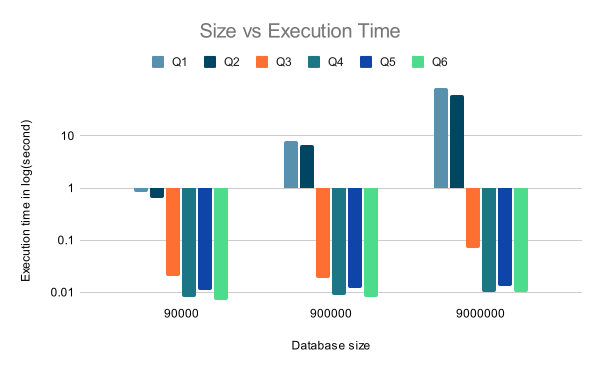
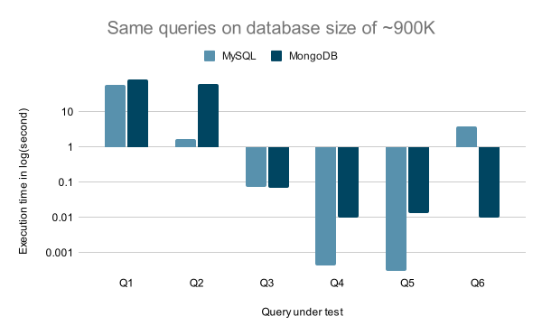

# Database Tuning

 
  

## Table of contents

- [Introduction](#Introduction)
- [Description](#Description)
- [Database ERD](#Database-ERD)
- [Experiment Queries](#Experiment-Queries)
  - [MySQL Performance](#MySQL-Performance)
  - [MongoDB Performance](#MongoDB-Performance)
  - [MySQL vs MongoDB Performance](#MySQL-vs-MongoDB-Performance)
- [Hardware Characteristics](#Hardware-Characteristics)
- [Recommendations](#Recommendations)
- [References](#References)
- [Contributors](#Contributors)
- [License](#License)

## Introduction

In real world situations, creating database projects is more just making a scheme that fits the description. We are usually faced with a lot of questions like:

- What DBMS should we use?
- Is it better to make it relational or NOSQL?
- How to get the best performance?
- What Hardware spec. are recommended to use?

## Description

In this Repository we experiment with the different concepts of database tuning and the different techniques used like:

- Optimizing the schema.
- Optimizing the memory requirements.
- Optimizing the queries.
- Testing the performace of MySQL vs MongoDB.

## Database ERD

## Experiment-Queries

1. Select ID, Name, and Gender of students who got an `"A"` in a course final exam. (`Schema Optimization was applied`)

2. Select all the research projects worked on by professors working in a certain department along with the professors’ names. (`Cache was used`)

3. Select ID, Name, Gender, and Salary of all professors with a salary less than `1200`. (`B-Tree Index was used`)

4. Select ID, Name, Gender, and Salary of a certain professor using his name. (`Hash Index was used`)

5. Select ID, Name, Gender, and Salary of all professors with Certain Name whose Salary is greater than `6000`. (`Hash Index and B-Tree were used`)

6. Select student ID, Name, and City of students with a specific name or who live in a specific city. (`Query Optimization was used`)

## Experiment Results

### MySQL Performance

### MongoDB Performance

### MySQL vs MongoDB Performance

## Hardware Characteristics

- OS: Windows 10 64-bits
- CPU: Intel® Core™ i7-8750 CPU @2.20GHz (12 CPUs)
- RAM: 16 GB
- Hard disk: 1 TB HDD

## Recommendations

- Using indexing in MySQL improves the queries execution time significantly at the cost of additional memory and slower updates.

- Taking your time to design the schema is a very important step in database design as we showed how schema optimization significantly improves the execution time of the queries involved in that optimization.

- Using SQL is better than NOSQL in complex queries that join multiple tables together, while NOSQL is better in retrieving a huge number of records from the same collection so when designing the NOSQL schema we should consider Embedding rather than referencing whenever possible.

- Using caching significantly decreases the execution time of frequently used selection queries. So we recommend using caching whenever possible but note that when data is too large you need a very large cache to have that significant speedup.

## References

- [MySQL Shell](https://dev.mysql.com/downloads/shell/)
- [DBSchema](https://dbschema.com/)
- [ERD Plus](https://erdplus.com/)
- [MySQL 5.7](https://dev.mysql.com/downloads/mysql/5.7.html)
- [MongoDB 4.4](https://docs.mongodb.com/v4.4/installation/)
- <a href="https://www.freepik.com/vectors/abstract">Abstract vector created by vectorjuice - www.freepik.com</a>

## Contributors

- [Muhammed Ahmad Hesham](https://github.com/Etshawy1)
- [Muhammed Alaa](https://github.com/MuhammeedAlaa)

## License

- Licensed under the [MIT License](./LICENSE).
